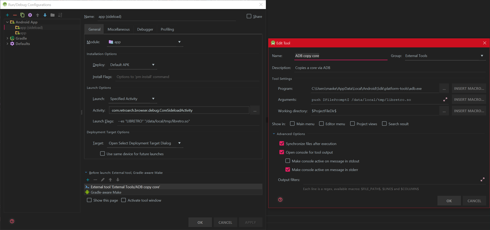

Phoenix Gradle Build
====================

Implements a Gradle build based on the existing phoenix sources.

It is currently only useful for running and debugging the RetroArch frontend in Android Studio.
This is caused by the fact that this build can't support the same older API level that the old Ant 
based build does. The minimum supported API level for this build is 16. Also this will not build the 
mips variant cause support for this architecture has long been removed from the Android NDK.
The only file that had to be duplicated is the AndroidManifest.xml because the modern Android build
won't allow SDK versions defined in this file anymore. It's also easier to change the app name this way.

To get this running follow these steps:

* Install the Android SDK Platform 28
* Install the latest Android NDK
* Import the project into Android Studio
* Make sure to select the appropriate build variant for your device (32 or 64 bit)

Sideloading a core
------------------

The `CoreSideloadActivity` activity allows you to sideload and run a core (with content) from your computer through ADB.

**Keep in mind that forcefully stopping the process will not save any configuration you did in RetroArch. If you want your config to be saved, use "Quit RetroArch" in the main menu.**

Usage :

```
adb shell am force-stop <package>
adb push <core> /data/local/tmp
adb shell am start -n <package>/com.retroarch.browser.debug.CoreSideloadActivity --es "LIBRETRO" "/data/local/tmp/<core>" --es "ROM" "<content>"
```

Where `<package>` is the target RetroArch app package name :
  - `com.retroarch` (RetroArch)
  - `com.retroarch.aarch64` (RetroArch64)
`<content>` is the path to the content to load (on your device) (optional)
and `<core>` is the path to the core to sideload (on your computer).

Alternatively you can set up Android Studio so that it prompts you for a core file to sideload on launching the app.
In the Run/Debug configuration dialog add another run configuration as outlined in the following screenshot

Specifically take note of the Launch Options section and make sure to add a new step to the "Before launch" section that prompts for the
core file to load. The tool configuration is shown on the right. If yu run this configuration a file chooser dialog will show 
where you can select the core to load. Keep in mind the filename is hardcoded so every time you load a different core it will be 
overwritten. You can create multiple configurations like this to work around this limitation.


Debugging a core
----------------

This has so far only been tested with a limited number of cores that use ndk-build. In theory this also works with CMake, but that's currently untested.

Following is an example of what it takes to debug the dosbox-svn core in Android Studio. It is based on the sideload technique outlined above.

**Note**: Make sure the filename of the core does not get changed. Set up your Run/Debug configuration accordingly (Launch flags and ADB arguments)! Otherwise debugging will not work.

* Clone dosbox-svn next to your RetroArch repo
* Run `ndk-build NDK_DEBUG=1` in dosbox-svn/libretro/jni
* In Android Studio create a new Gradle module of type Android Library. You can delete everything but AndroidManifest.xml and build.gradle from the new directory.
* In the newly created build.gradle file add the following in the `defaultConfig {}` block:
```
ndk {
   moduleName "dosbox-svn"
}
```
Also add the following in the `android {}` block:
```
externalNativeBuild {
    ndkBuild {
        path file('../../../../../dosbox-svn/libretro/jni/Android.mk')
    }
}
```
* Let the offered Gradle Sync run. You should see the core sources pop up in Android Studio.
* Set a breakpoint in the core code.
    * A good example to check if the setup is working is `retro_get_system_info` which is called on core load
* In the Run/Debug Configurations dialog in Android Studio under Debugger -> Symbol Directories make sure to have your core symbols loaded. You should have two directories there (as per your architecture and core):
    * /path/to/phoenix-gradle/app/build/intermediates/ndkBuild/ra<32 or 64>/debug/obj/local/<your_arch>
    * /path/to/dosbox-svn/libretro/obj/local/<your_arch>
* Start the app with the sideload debug config from Android Studio
* The breakpoint should trigger once the core gets loaded
